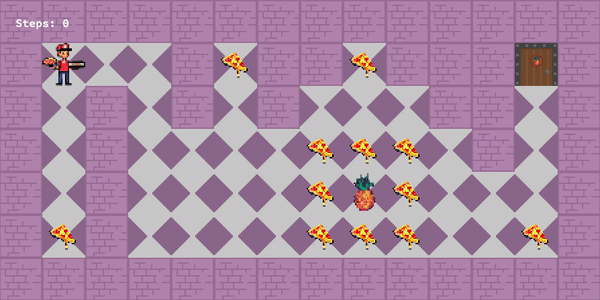

# so_long

push_swap is a project developed for 42 Heilbroon School.
## Keywords
C programming - data structure - videogames - MLX42 library

<div align="center">
	
</div>


## Subject
In this project I had to create a simple top-down view videogame, using C as programming language, and the [MLX42 Codam](https://github.com/codam-coding-college/MLX42.git) library. For more info about the requirements, take a look at the [subject](en.subject.pdf) contained in this repo.

## Brief explanation
The project covers the following topics:

### 1. Input validation
As the project subject specifies, the input has to be correctly validated. The validation part includes: map file format, map sourrounded by walls, the presence of one Player and one Exit without duplicates, the presence of at least one Collectible, a rectangular map, a valid path to make the game playable.

### 2. Collecting data
During the validation process, the data is collected and stored into a so called `t_data` structure. A map as `char **` is created as a base of data on which the graphical part is built. Other data is collected and stored, based on the requirements of the project.

### 3. Use of the graphical library
It is mandatory the use of MLX42 library, which handles the window and the images. For a deeper knowledge, I suggest to give a read to the official documentation of [MLX42](https://github.com/codam-coding-college/MLX42.git)

### 4. Leaks free
Like in any other project of 42, the memory allocated by `malloc()` has to be properly freed. No leaks are tolerated. In this project I checked the leaks using a project of a school mate, which re-implements the `malloc()` function and traces the allocated memory. Take a look at the amazing project of [iwillenshofer](https://github.com/iwillenshofer/leak_finder).

## Bonus
The bonus part of the project is about add some simple animations to the sprites, make the player lose in case of touching an enemy and display the steps done directly on the screen instead of output them on the terminal.

---

## Try it out
1. Clone the repository:
```
git clone git@github.com:NicoCastelnuovo/so_long.git so_long
```
2. Navigate to the `so_long` directory and `make` program, or `make bonus` for more funcionalities:
```
cd so_long
make bonus
```
According to the Makefile, this should compile the program, using the local version of the library. To get an idea about the dependencies of the library, I suggest again to read the [MLX42](https://github.com/codam-coding-college/MLX42.git) documentation. *

3. Execute it, passing a valid map as argument:
```
./so_long maps/valid/map_3.ber
```
4. Move the player using `W` `A` `S` `D`, and terminate the program using `Esc`.

5. Save the poor Pizza Boy from the disgusting Ananas!

> **Note:** The program has been built on MacOs so, even the MLX42 library works also on Linux and Windows, it's not guaranteed the same behavior on the other platforms.

### Common error during `make`
Some dependencies are not installed or matched. In order to compile, MLX42 needs `cmake` and `glfw`. The problem could be either that they are not installed, or they are not in the correct path specified in the Makefile rules. For a more detailed explaination, visit the [MLX42](https://github.com/codam-coding-college/MLX42.git) repo and follow the instructions.

